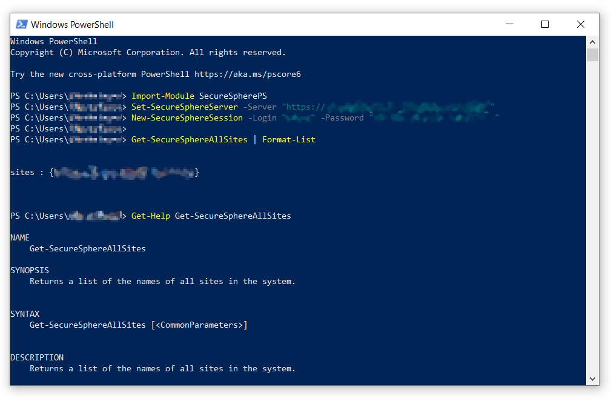
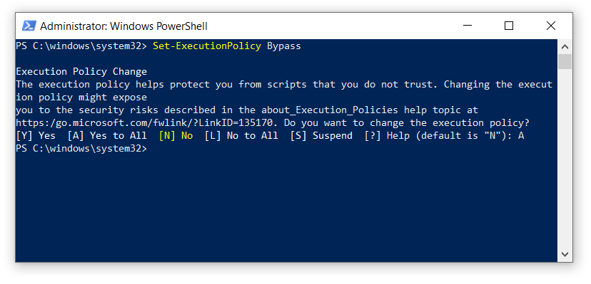
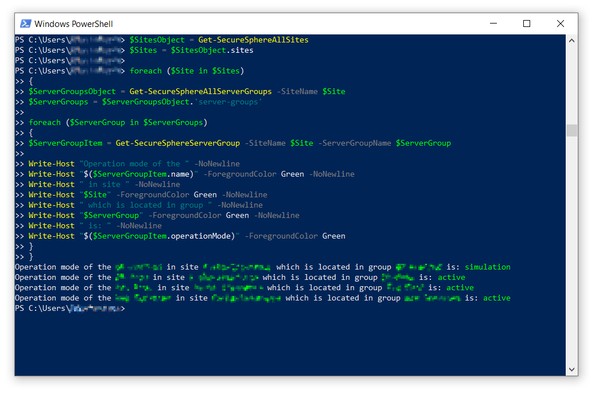

#  SecureSpherePS

<a href="https://img.shields.io/github/license/akshinmustafayev/SecureSpherePS">
  
</a>
<a href="https://img.shields.io/tokei/lines/github/akshinmustafayev/SecureSpherePS">
  
</a>
<a href="https://img.shields.io/github/downloads/akshinmustafayev/SecureSpherePS/total">
  
</a>
<a href="https://img.shields.io/github/stars/akshinmustafayev/SecureSpherePS?style=social">
  
</a>
<a href="https://img.shields.io/github/contributors/akshinmustafayev/SecureSpherePS">
  
</a>

<br><br>


---

## :newspaper: Description

SecureSpherePS - PowerShell Module to manage Imperva SecureSphere 13.6. Automate and control your Imperva SecureSphere Web Application Firewall with PowerShell.



## :wrench: Installation

* Download the latest release or use direct link [SecureSpherePS.zip](https://github.com/akshinmustafayev/SecureSpherePS/releases/download/v0.1/SecureSpherePS.zip). 
* Create folder __SecureSpherePS__ in __C:\Program Files\WindowsPowerShell\Modules__ directory.
* Extract contents of ZIP archive to __C:\Program Files\WindowsPowerShell\Modules\SecureSpherePS__ folder.
* Run _Windows PowerShell_ as _Administrator_.
* Set execution policy using cmdlet:

  ```
  Set-ExecutionPolicy Bypass 
  ```
  
  
* Load module using cmdlet:

  ```
  Import-Module SecureSpherePS
  ```

## :clipboard: Usage

```
# First we load the module
Import-Module SecureSpherePS

# Then we Set a SecureSphere server where we want to connect
Set-SecureSphereServer -Server "https://mxserver01:8083"

# Then we connect to server using login and password
New-SecureSphereSession -Login "administrator" -Password "some_cool_password"
```

To get a list of all available commands use:
```
Get-Command -Module SecureSpherePS
```

To get help for the command:
```
# Specify cmdlet name from the list
Get-Help Get-SecureSphereAllMXs -Full
```

## :pushpin: Example
```
$SitesObject = Get-SecureSphereAllSites
$Sites = $SitesObject.sites

foreach ($Site in $Sites)
{
	$ServerGroupsObject = Get-SecureSphereAllServerGroups -SiteName $Site
	$ServerGroups = $ServerGroupsObject.'server-groups'
	
	foreach ($ServerGroup in $ServerGroups)
	{
		$ServerGroupItem = Get-SecureSphereServerGroup -SiteName $Site -ServerGroupName $ServerGroup
		
		Write-Host "Operation mode of the " -NoNewline
		Write-Host "$($ServerGroupItem.name)" -ForegroundColor Green -NoNewline
		Write-Host " in site " -NoNewline
		Write-Host "$Site" -ForegroundColor Green -NoNewline
		Write-Host " which is located in group " -NoNewline
		Write-Host "$ServerGroup" -ForegroundColor Green -NoNewline
		Write-Host " is: " -NoNewline
		Write-Host "$($ServerGroupItem.operationMode)" -ForegroundColor Green
	}
}
```



## :blue_book: Documentation

List of available cmdlets is [here](Documentation/MD/README.md).

## :dart: Contribution

Contribution is very much appreciated. Hope that this module might be useful for you!

